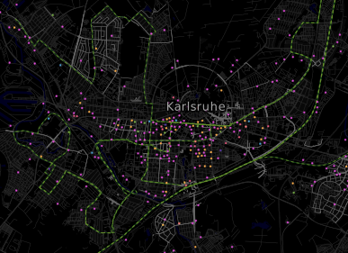

# nachtlebenkarte
Nachtleben-Kartenstil für OpenStreetMap (osm2pgsql, CartoCSS)

Dieser Kartenstil war Gegenstand der Bachelor-Arbeit von Lisa Stolz
an der Hochschule Karlsruhe im Juli 2015. Die Arbeit wurde von 
Frederik Ramm bei der Geofabrik extern betreut.

Das Verzeichnis enthält die benötigten .mss-Dateien sowie eine .yml-
Datei, mit der in "Kosmtik" direkt gearbeitet werden kann. 

Zur direkten Verwendung in Mapnik muss erst die .yml in eine .mml 
umgewandelt werden, siehe z.B. https://github.com/gravitystorm/openstreetmap-carto/blob/master/scripts/yaml2mml.py 

Danach ist die .mml mit "carto" in eine Mapnik-XML umzuwandeln.

Der Stil beruht auf einem osm2pgsql-Import mit der "--hstore"-Option.

Der Kartenstil wird unter der freien Lizenz CC-BY-SA 3.0 veröffentlicht.

Die vollständige Bachelor-Arbeit befindet sich als PDF in diesem Github-Repository.

Performance
-----------

Performance-Optimierungen spielten bei der Arbeit selbst keine große Rolle,
da nur mit einem Extrakt gearbeitet wurde. Bei der Implementierung auf einem
Server mit weltweitem Datenbestand wurden zur Verbesserung der Performance 
einige spezielle Indizes angelegt:

Außerdem mussten die "Union"-Queries, damit die Indizes Anwendung finden konnten,
so umgeschrieben werden, dass die Geometriebedingung in jedem Teilquery auftaucht. 
Standardmäßig erzeugt Mapnik aus den hier verwendeten Union-Queries etwas wie 
dieses:

    SELECT felder FROM 
       (SELECT irgendwas UNION SELECT wasanderes)
    WHERE way && ST_MAKEBOX(geometriebedingung)

Besser ist aber

    SELECT felder FROM
       (SELECT irgendwas WHERE way && ST_MAKEBOX(geometriebedingung)
       UNION
       SELECT wasanderes WHERE way ST_MAKEBOX(geometriebedingung))

Hierzu arbeitet man mit "... and way && !bbox!" in den Layer-SQL-Bedingungen.
Weil das SQL dadurch aber schlechter lesbar wird, haben wir hier die 
ebenfalls funktionierende Originalversion veröffentlicht.

Demo-Ansicht
------------

Auf http://sanday.geofabrik.de/night.html kann eine weltweite Demo-Ansicht der
Karte betrachtet werden. Aber Achtung, dieser Server kann jederzeit abgeschaltet
werden. Weiterentwicklungen dieser Karte durch Dritte sind durchaus willkommen.

